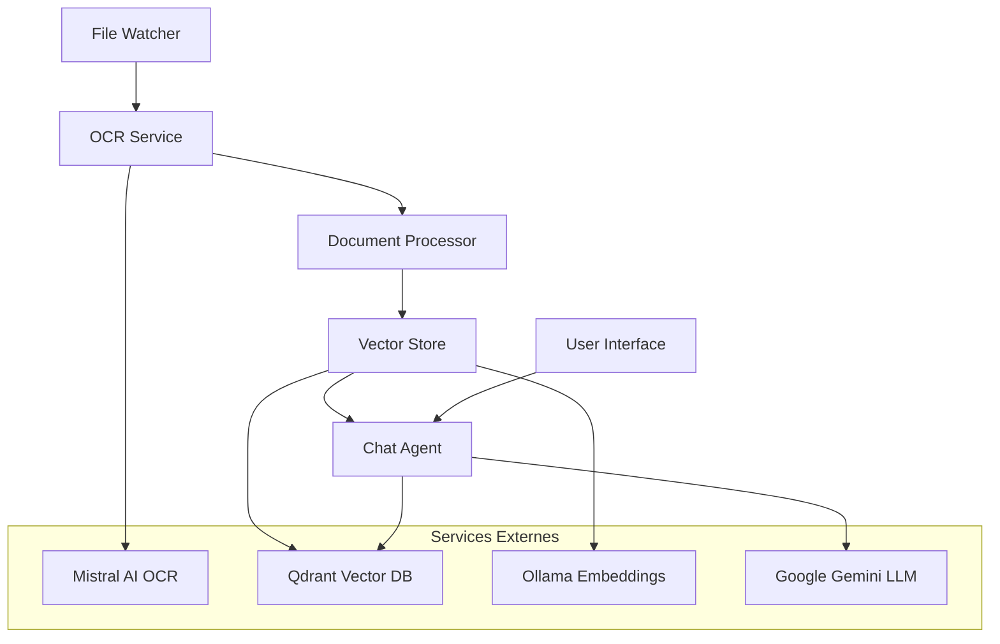

# RAG PDF avec OCR Mistral

Système RAG (Retrieval Augmented Generation) complet qui automatise le traitement de documents PDF en utilisant l'OCR de Mistral AI, la vectorisation avec Qdrant, et un agent conversationnel intelligent.

## 🚀 Fonctionnalités

- **Surveillance automatique** de dossiers pour nouveaux PDF
- **OCR intelligent** avec Mistral AI pour extraction de texte
- **Vectorisation** automatique avec Ollama et stockage Qdrant
- **Chat intelligent** avec Google Gemini et recherche contextuelle
- **Interface web** simple et intuitive
- **Déploiement Docker** complet avec monitoring
- **Gestion d'erreurs** robuste avec retry automatique
- **Logging structuré** et notifications d'alertes

## 📋 Prérequis

### Système
- Docker Engine 20.10+
- Docker Compose 2.0+
- 4GB RAM minimum (8GB recommandé)
- 10GB espace disque libre

### Clés API Requises
- **Mistral AI API Key** : [Obtenir ici](https://console.mistral.ai/)
- **Google Gemini API Key** : [Obtenir ici](https://makersuite.google.com/app/apikey)

## ⚡ Installation Rapide

### 1. Cloner le Projet

```bash
git clone <repository-url>
cd rag-pdf-mistral-ocr
```

### 2. Configuration Automatique

```bash
# Rendre le script exécutable
chmod +x scripts/setup.sh

# Lancer la configuration (production)
./scripts/setup.sh

# Ou pour le développement
./scripts/setup.sh dev
```

Le script va :
- Vérifier les prérequis
- Configurer l'environnement
- Créer les dossiers nécessaires
- Télécharger et construire les images
- Démarrer tous les services
- Configurer Ollama avec le modèle d'embeddings

### 3. Configuration Manuelle (Alternative)

```bash
# Copier et éditer la configuration
cp .env.example .env
nano .env

# Ajouter vos clés API
MISTRAL_API_KEY=your_mistral_api_key_here
GEMINI_API_KEY=your_gemini_api_key_here

# Démarrer les services
docker-compose up -d

# Configurer Ollama
docker-compose exec ollama ollama pull nomic-embed-text
```

## 🎯 Utilisation

### Traitement de Documents

1. **Déposer des PDF** dans le dossier `./input/`
2. **Surveillance automatique** : Les fichiers sont traités automatiquement
3. **Résultats** : Consultez les logs ou l'interface web

### Interface Chat

Accédez à l'interface web sur `http://localhost:3000` pour :
- Poser des questions sur vos documents
- Obtenir des réponses contextualisées
- Voir les sources citées

### API REST

```bash
# Endpoint de santé
curl http://localhost:3000/health

# Chat API
curl -X POST http://localhost:3000/api/chat \
  -H "Content-Type: application/json" \
  -d '{"query": "Que dit le document sur les maladies du maïs?"}'
```

## 🏗️ Architecture



## 🐳 Services Docker

| Service | Port | Description |
|---------|------|-------------|
| rag-app | 3000 | Application principale |
| qdrant | 6333 | Base de données vectorielle |
| ollama | 11434 | Service d'embeddings |
| redis | 6379 | Queue de traitement |

## 📁 Structure des Dossiers

```
rag-pdf-mistral-ocr/
├── input/          # PDF à traiter
├── output/         # Résultats de traitement
├── error/          # Fichiers en erreur
├── logs/           # Logs de l'application
├── src/            # Code source
├── scripts/        # Scripts utilitaires
├── docs/           # Documentation
└── monitoring/     # Configuration monitoring
```

## 🔧 Gestion des Services

### Commandes Essentielles

```bash
# Voir le statut
docker-compose ps

# Voir les logs
docker-compose logs -f rag-app

# Redémarrer un service
docker-compose restart rag-app

# Arrêter tous les services
docker-compose down

# Mise à jour
docker-compose pull
docker-compose up -d
```

### Mode Développement

```bash
# Démarrer en mode dev
docker-compose -f docker-compose.dev.yml up -d

# Accès aux outils de dev
# - Redis Commander: http://localhost:8081
# - Debugger Node.js: Port 9229
# - Hot reload automatique
```

### Monitoring (Optionnel)

```bash
# Démarrer avec monitoring
docker-compose --profile monitoring up -d

# Accès aux interfaces
# - Prometheus: http://localhost:9090
# - Grafana: http://localhost:3001 (admin/admin123)
```

## 💾 Sauvegarde et Restauration

### Sauvegarde

```bash
# Sauvegarde automatique
./scripts/backup.sh

# Sauvegarde avec nom personnalisé
./scripts/backup.sh mon_backup_2024
```

### Restauration

```bash
# Restaurer une sauvegarde
./scripts/restore.sh backup_file.tar.gz

# Lister les sauvegardes disponibles
ls -la backups/
```

## 🔍 Résolution de Problèmes

### Problèmes Courants

#### Services ne démarrent pas
```bash
# Vérifier les logs
docker-compose logs

# Vérifier l'espace disque
df -h

# Nettoyer Docker
docker system prune -f
```

#### Erreurs d'API
```bash
# Vérifier les clés API
docker-compose exec rag-app env | grep API_KEY

# Tester la connectivité
docker-compose exec rag-app curl -I https://api.mistral.ai/v1/files
```

#### Modèle Ollama manquant
```bash
# Télécharger le modèle
docker-compose exec ollama ollama pull nomic-embed-text

# Vérifier les modèles installés
docker-compose exec ollama ollama list
```

### Logs et Debugging

```bash
# Logs détaillés
docker-compose logs -f --tail=100

# Accéder au conteneur
docker-compose exec rag-app sh

# Vérifier les connexions
docker-compose exec rag-app nc -zv qdrant 6333
```

## 📊 Performance

### Limites par Défaut
- **Taille max PDF** : 50MB
- **Chunks de texte** : 2000 caractères
- **Contexte chat** : 5 chunks maximum
- **Timeout réponse** : 5 secondes

### Optimisation

```bash
# Dans .env, ajuster :
MAX_FILE_SIZE=104857600  # 100MB
CHUNK_SIZE=4000          # Chunks plus grands
MAX_CONTEXT_CHUNKS=10    # Plus de contexte
CONCURRENT_PROCESSING=5   # Plus de parallélisme
```

## 🔒 Sécurité

- **Utilisateur non-root** dans les conteneurs
- **Réseau Docker isolé**
- **Variables d'environnement** pour les secrets
- **Health checks** automatiques
- **Logging sécurisé** sans exposition de données sensibles

## 📚 Documentation

- [Guide de Déploiement Docker](docs/DOCKER_DEPLOYMENT.md)
- [Documentation API](docs/API.md)
- [Guide de Développement](docs/DEVELOPMENT.md)
- [Spécifications Techniques](.kiro/specs/rag-pdf-mistral-ocr/)

## 🤝 Contribution

1. Fork le projet
2. Créer une branche feature (`git checkout -b feature/AmazingFeature`)
3. Commit les changements (`git commit -m 'Add AmazingFeature'`)
4. Push vers la branche (`git push origin feature/AmazingFeature`)
5. Ouvrir une Pull Request

## 📄 Licence

Ce projet est sous licence MIT. Voir le fichier `LICENSE` pour plus de détails.

## 🆘 Support

- **Issues** : [GitHub Issues](https://github.com/your-repo/issues)
- **Documentation** : Dossier `/docs/`
- **Logs** : `docker-compose logs -f`

---

**Développé avec ❤️ pour automatiser le traitement intelligent de documents PDF**